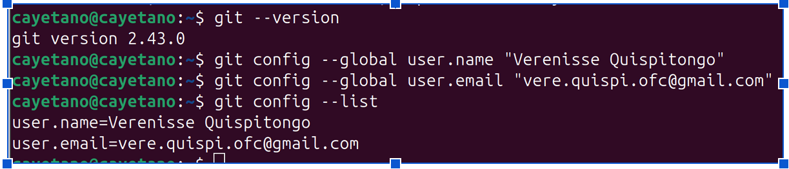

Actividad Complementaria: Gestión Segura de Evidencias con Git y GitHub
### Objetivo
Aplicar mecanismos de protección de la información mediante el uso de control de versiones, autenticación y repositorios privados para almacenar evidencias de las prácticas realizadas en Linux.

## Parte 1: Creación de Cuenta GitHub
Cada estudiante deberá:
Crear una cuenta en GitHub.
Configurar autenticación segura.
Activar la autenticación de dos factores (2FA).
### Evidencia
Captura de:
Cuenta creada.
Activación de 2FA.
Perfil configurado.

## Parte 2: Instalación y Configuración de Git en Linux
### Instalación
Ubuntu/Debian
sudo apt update
sudo apt install git
### Verificación:
git --version

### Configuración inicial
git config --global user.name "Nombre Apellido"
git config --global user.email "correo@ejemplo.com"
Verificar:
git config --list
### Evidencia
Captura mostrando la configuración realizada.

Verenisse: 

## Parte 3: Creación de Repositorio Privado
Cada estudiante deberá crear un repositorio denominado:
SO-Seguridad-2026
Configuración:
Privado
Sin acceso público
Descripción del curso
### Evidencia
Captura del repositorio creado.

## Parte 4: Organización Segura de Evidencias
Crear la siguiente estructura:
SO-Seguridad-2026/
│
├── Capitulo1/
├── Capitulo2/
├── Capitulo3/
├── Capitulo4/
├── Capitulo5/
├── Capitulo6/
└── Informe_Final/
Cada carpeta contendrá:
- Capturas
- Comandos ejecutados
- Resultados obtenidos
- Análisis

## Parte 5: Protección de Datos Sensibles
Crear archivo:
touch .gitignore
Contenido:
*.log
*.key
*.pem
*.crt
passwords.txt
credenciales.txt
### Objetivo
Evitar la publicación accidental de:
Contraseñas
Claves SSH
Certificados
Archivos sensibles
### Evidencia
Captura del archivo .gitignore.

## Parte 6: Generación de Claves SSH
Generar clave SSH:
ssh-keygen -t ed25519 -C "correo@ejemplo.com"
Ver clave pública:
cat ~/.ssh/id_ed25519.pub
Registrar la clave en GitHub.
### Evidencia
Captura de la clave agregada en GitHub.

## Parte 7: Subida de Evidencias
Inicializar repositorio:
git init
Agregar archivos:
git add .
Primer commit:
git commit -m "Primera entrega de evidencias"
Asociar repositorio remoto:
git remote add origin https://github.com/usuario/SO-Seguridad-2026.git
Enviar evidencias:
git push -u origin main

## Parte 8: Control de Integridad
Generar hash SHA-256 de evidencias importantes:
sha256sum informe_final.pdf
Guardar resultado en:
hashes.txt
Subir archivo al repositorio.
### Objetivo
Garantizar que las evidencias no han sido modificadas.

## Parte 9: Gestión de Permisos
El estudiante deberá:
Mantener el repositorio privado.
Compartir únicamente con el docente.
Otorgar permiso de lectura al docente.
### Evidencia
Captura de:
Collaborators.
Permisos asignados.

## Parte 10: Informe Final de Seguridad
Cada estudiante elaborará un informe indicando:
Amenazas identificadas
Acceso no autorizado.
Robo de credenciales.
Modificación de archivos.
Divulgación de información.
Medidas implementadas
Permisos Linux.
ACL.
Hash SHA-256.
Git.
GitHub privado.
SSH.
Autenticación de dos factores.
